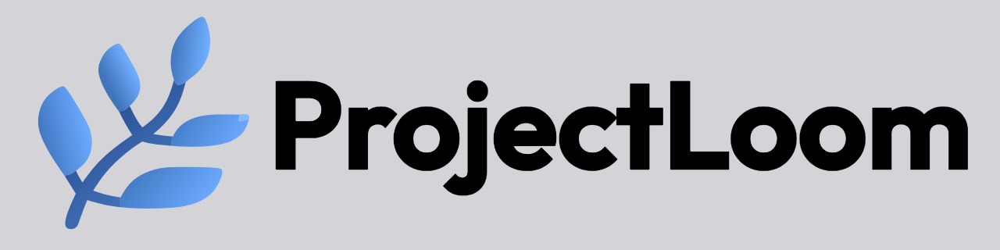

# ProjectLoom

<p align="center">
  
</p>

**Visual canvas for AI conversations.** Escape the linear chat window — branch, merge, and spatially organize your AI conversations as an infinite canvas of connected nodes.

---

## What it is

ProjectLoom lets you treat AI conversations the way a developer treats code: branch from any point, explore multiple directions in parallel, merge threads back together, and navigate your entire conversation history as a structured graph rather than a scrolling list.

- **Infinite canvas** — drag and position conversation cards freely in 2D space
- **Branching** — fork any conversation at any message to explore alternate paths
- **Merging** — pull multiple conversation threads into a single node (up to 5 parents)
- **Inherited context** — child cards automatically receive context from their ancestors
- **Knowledge base** — attach documents to a workspace; the AI has access to them in every conversation
- **Web search** — ground responses in live search results via Tavily
- **Canvas context** — the AI knows where in the DAG it sits and what surrounds it
- **Auto-titles** — cards name themselves based on conversation content
- **Light / dark theme** — instant switch, no flash

---

## Bring Your Own Key

ProjectLoom is **BYOK** — your API keys are sent directly from your browser to Anthropic/OpenAI and are never stored on any server. You need at least one of:

- [Anthropic API key](https://console.anthropic.com/) — for Claude models
- [OpenAI API key](https://platform.openai.com/) — for GPT / o-series models

---

## Running locally

```bash
git clone https://github.com/modryn-studio/ProjectLoom.git
cd ProjectLoom
npm install
npm run dev
```

Open [http://localhost:3000](http://localhost:3000), enter your API key(s) in Settings, and start building.

---

## Stack

- **Next.js 16** (App Router, Turbopack) + **React 19**
- **Vercel AI SDK v6** — streaming, tool calls, web search
- **React Flow** — canvas and edge rendering
- **Zustand** — all client state including undo/redo
- **TypeScript** strict mode throughout

---

## Feedback

Questions, bugs, or ideas — [hello@modrynstudio.com](mailto:hello@modrynstudio.com)
